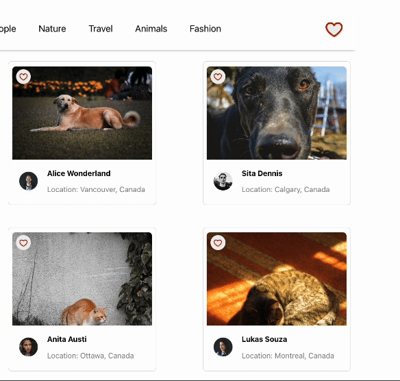

# Photolabs

PhotoLabs is a React-based single-page application (SPA) designed to provide users with a seamless experience for viewing stock photos in different contexts. It allows users to browse, explore, and interact with photos in an organized and intuitive manner.

This project is built in four key phases, each focusing on progressively implementing React concepts and integrating API data.


## Setup

Install dependencies with `npm install` in each respective `/frontend` and `/backend`.

## [Frontend] Running Webpack Development Server

```sh
cd frontend
npm start
```

## [Backend] Running Backend Servier

Read `backend/readme` for further setup details.

```sh
cd backend
npm start
```

## Technologies Used

- **Frontend**: React, Create React App (CRA), SCSS
- **Backend**: Express (for the API server)
- **State Management**: React Context API, useState, useReducer
- **API**: Custom API for fetching photo data (RESTful)


## Features

- **Browse Photos**: View high-quality stock photos from various categories.
- **Favorite Photos**: Mark photos as favorites for easy access later.
- **Photographer Info**: Display details about the photographer, including name and location.
- **Similar Photos**: View related photos based on a selected image.
- **Responsive Design**: Fully responsive layout for various screen sizes.


## Guide for Photolabs Website

Upon loading the PhotoLabs website, users will see a gallery of photos along with profile pictures and other information. Below is a brief walkthrough of the main screens and features.

<br><br>
### Photo Gallery & Photo Categories
The homepage displays all photos along with the photographer’s profile picture and details.

Users can browse photos by selecting topics or categories, making it easy to explore themed content.


<br><br>
### Photo Details Modal
Clicking on a photo opens a modal displaying a full-size version, along with other related photos below it.


<br><br>
### Favorite Button
Each photo have the favourite button on the left top side, and it will be notified with right top favourite button whenever the user click the favourite button. 



<br><br>

## Phases of Development

The project is built in four main phases:

- **Component Isolation**: Build the smallest reusable components first (e.g., buttons, list items) and progress up to more complex components.
- **State Management**: Utilize React's useState and useReducer hooks for managing state within components.
- **API Integration**: Fetch and display data from the custom API, including photos and photographer information.
- **Advanced React Patterns**: Implement advanced patterns to handle state efficiently and add live updates as the application changes.

<br> </br>

## Future Enhancements

- **User Authentication**: Allow users to create accounts, save favorites, and upload photos.
- **Search Functionality**: Add a search bar to allow users to filter photos by keywords.
- **Photo Categorization**: Tag and categorize photos for easier browsing.
- **Photo Editing**: Enable users to apply filters and edit photos within the app.


