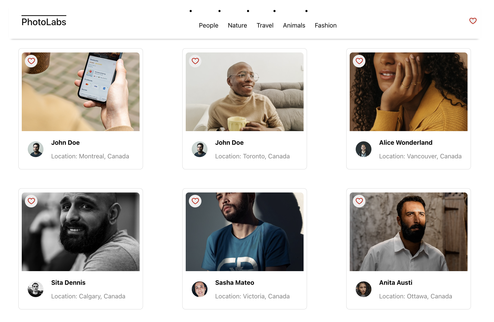

# react-photolabs
The PhotoLabs project for the Web Development React course programming.

# Photolabs

## Setup

Install dependencies with `npm install` in each respective `/frontend` and `/backend`.

## [Frontend] Running Webpack Development Server

```sh
cd frontend
npm start
```

## [Backend] Running Backend Servier

Read `backend/readme` for further setup details.

```sh
cd backend
npm start
```

## Guide for Photolabs Website

User will see the all the photos with the profile picture and the information at first.


There are some topics of the pictures that user can choose. 



When user click the picture, a modal will pop up and show a full size of picutre with other related pictures below.


Each photo have the favourite button on the left top side, and it will be notified with right top favourite button whenever the user click the favourite button. 


